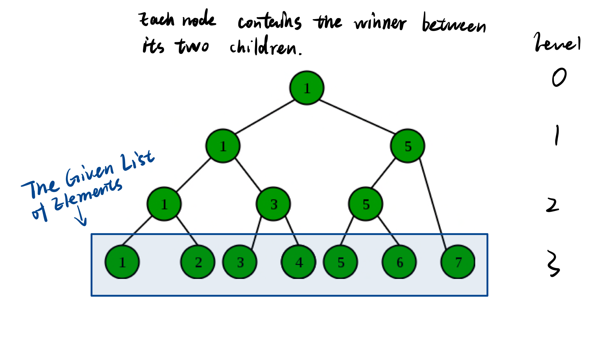

# CS225 Assignment3 | Group 10
## Exercise 1
#### 1.1
The minimum cannot be determined unless all $n$ values have been visited. Then the number of comparisons must be $n-1$ because when traversing the array, the first encountered entry is not compared.
#### 1.2
Consider a min-heap

All leaf nodes in the heap represent all entries in the array. Each internal node (nodes with degree 2) has the smaller entry between its two children, which stands for a comparison. Then the number of comparisons, i.e. the number of internal nodes, is given by $L = (n-1)\cdot I + 1$.  
Plug in $L = n$ (n stands for size), $n = 2$, (n stands for the arity of the tree) then $I = n - 1$   
Namely, determining the minimum entry take $n-1$ comparisons.

Now, to determine the second minimum, we need to compare the minimum to all elements that are ever compared to it. Then the number of comparisons is given by the height of the heap, which is $log(n)$

Thus the minimum number of comparisons needed is $n-1 + \log(n)$

#### 1.3
> Input  

A doubly linked list of elements with handles stored in an array  

> Output  

The first and second minimum of the elements.  

> Algorithm Description  

The algorithm finds the first minimum with a normal n-1 number of comparisons, then it locates the second minimum by merits of a ***winner tree***. The exact steps are as follows:

1. Starting from the bottom (level 3) (up to this stage the winner tree has not been built), where leaf nodes represents original elements in the list.
2. Execute a comparison between adjacent elements, then form the second bottom level of the winner tree, with nodes represent winners in the comparison.
3. Now move to next level (level 2) and recursively execute comparisons between nodes, again add winners to further complete the tree.
4. As we get to the root of the tree (the only winner is found), the minimum has been found. **Now the algorithm has consumed n-1 comparisons
5. To find the second minimum, the algorithm locates the other child of all nodes containing the minimum just found, and executes comparisons between these children, which takes $log(n)$ comparisons to complete.

## Exercise 2
> Code for this part of assignment is stored in folder "Q2“

## Exercise 3
 <!-- Author: Yuxuan Jiang | Group 10 -->
 <!--CS225 Homework 3 Q3   -->
#### 3.1
**The Sorted Version**  
Maintain the list in ascending order of priority.  
**The Unsorted Version**  
Inserting new elements at the next of the dummy node. Traverse the whole list to locate the minimum.

#### 3.2
|| $delete\_min()$ | $insert(k)$| $delete(h)$|$decrease(h,k)$|
|:-----  |:----------:|:---------:|:-:|:-:|
|Sorted  |$O(1)$|$O(n)$|$O(1)$|$O(n)$|
|Unsorted|$O(n)$|$O(1)$|$O(1)$|$O(1)$|

> **Justification of the Complexity:**  
> 1. $delete\_min()$  
> For the sorted list, $delete\_min()$ can be done by just deleting the first element encountered in the list, which takes $O(1)$ time.  
> For the unsorted list, $delete\_min()$ requires to traverse the entire list in order to determine the minimum, which takes $O(n)$ time.
> 2. $insert(k)$  
> For the sorted list, $insert(k)$ requires to traverse the list to determine to location where the element to be inserted should be, which takes $O(n)$ time.  
> For the unsorted list, $insert(k)$ can be done by simply adding the element at the next of the dummy node, which takes $O(1)$ time.
> 3. $delete(h)$  
> Given the handle, for both lists we can directly access the element to be deleted, then the deletion takes constant time, thus the entire function takes $O(1)$ time for both options.
> 4. $decrease(h,k)$  
> For the sorted list, $decrease(h,k)$ is equivalent to first $delete(h)$ and then $insert(k)$, thus taking $O(n)$ time as having been justified in 2. and 3.   
> For the unsorted list, $decrease(h,k)$ is equivalent to first $delete(h)$ and then $insert(k)$, thus taking $O(1)$ time as having been justified in 2. and 3.

## Exercise 4
#### 4.1
### Same as in Max heap, simply add the k new elements into the end of the heap. Every time a new elements is added, one $sift\ up$ is executed.

### fake code :

#### Heap_add :

##### 	for k times :		

##### 		Heap[numitems] = new_elements

##### 		numitems++

##### 		$sift\ up$ ($\lfloor numitems/2 \rfloor$)

#### $sift\ up$(parent) :

##### while $\lfloor parent / 2 \rfloor$$>$ 1

##### left_child = 2*parent

##### 		right_child = 2*parent+1

##### 		parent = $Max${parent, left_child, right_child}

##### 		parent =$\lfloor parent / 2 \rfloor$

#### 4.2
For this question we have two approaches. The first approach is listed here, while the second approach as indicated by the hint is contained separately in Q4.pdf under this directory.

First Approach:

To insert k new elements into a max-heap with n elements within $O(k+\log(n))$, our algorithm executes the following procedures:  

1. rearranges the k-elements into a max-heap structure, **which takes $O(k)$ time**.  
2. merge the max-heap with n elements and the newly-built max-heap with k elements, **which takes $O(\log(n))$ time, given that heaps are implemented using tree nodes (which implies that the algorithm doesn't need to spend time balancing the heap).

Hence in total our algorithm achieves the specified task within $O(k + \log(n))$ time.

***Justification of Procedure 1***  
The k-element max-heap is built with $sift-down$.  
The execution of inserting an arbitrary element at height $h$ takes the time complexity $O(h)$.
For finding the Time Complexity of building a heap, we must know the number of nodes having height $h$. Since at height h the heap can have at most $\lceil{\frac{k}{2^{h+1}}}\rceil$ thus the total complexity shall be 
$$
\begin{aligned}
\sum^{\log(k)}_{h = 0}(\frac{k}{2^{h+1}}\cdot O(h)) & = \sum^{\infty}_{h = 0}(\frac{k}{2^{h+1}}\cdot O(h)) \\
& = O(k \cdot \sum^{\infty}_{h = 0}{\frac{h}{2^h}})\\
\end{aligned}
$$

For x < 1, we have 
$$\sum_{n = 0}^\infty{x^n} = \frac{1}{1-x}$$
Take the derivative of both sides then multiply by 1, we get
$$\sum_{n = 0}^\infty{n\cdot x^n} = \frac{x}{(1-x)^2}$$
Thus 
$$\sum^\infty_{h=0}{\frac{h}{2^h}} = \frac{\frac12}{{\frac12}^2} = 2$$  
And further, 
$$build\_heap = O(k\cdot 2) = O(k)$$

*Justification of Procedure 2*  
We use a recursive approach to merge the two trees, which takes $O(\log(n))$ time.
The procedure can be described as follows:  
$$
\begin{aligned}
&result \leftarrow {\rm Merge}(heap\_n, heap\_k)\\
&\qquad \boldsymbol{\rm IF}\ heap\_n.left = \boldsymbol{\rm  NONE}\ \boldsymbol{\rm \&}\ heap\_n.right = \boldsymbol{\rm NONE}\ \boldsymbol{\rm THEN}  \\
&\qquad \qquad result \leftarrow {\rm Insert}(heap\_n, heap\_k) \\
&\qquad \qquad \boldsymbol{\rm RETURN} \\

&\qquad \boldsymbol{\rm IF}\ heap\_k.left = \boldsymbol{\rm NONE}\ \boldsymbol{\rm \&}\ heap\_k.right = \boldsymbol{\rm NONE}\ \boldsymbol{\rm THEN}\\
&\qquad \qquad result \leftarrow {\rm Insert}(heap\_k, heap\_n) \\
&\qquad \qquad \boldsymbol{\rm RETURN} \\

&\qquad \boldsymbol{\rm IF}\ heap\_n.value > heap\_k.value\ \boldsymbol{\rm THEN} \\
&\qquad \qquad \boldsymbol{\rm LET}\ \begin{aligned} child\_1 & =heap\_n.left \\ child\_2 & =heap\_n.right\end{aligned} \ \ \boldsymbol{\rm IN\ PAR} \\
& \qquad \qquad \qquad heap\_n.left = {\rm Max}(child\_1.value, child\_2.value)\\
& \qquad \qquad \qquad heap\_n.right = {\rm Merge}({\rm Min}(child\_1.value, child\_2.value), heap\_k) \\
& \qquad \qquad \qquad \boldsymbol{\rm END\ PAR} \\
& \qquad \qquad  result := heap\_n \\
& \qquad \qquad  \boldsymbol{\rm RETURN} \\
& \qquad \boldsymbol{\rm END IF} \\

& \qquad \boldsymbol{\rm IF}\ heap\_n.value < heap\_k.value\ \boldsymbol{\rm THEN} \\
&\qquad \qquad \boldsymbol{\rm LET}\ \begin{aligned} child\_1 & =heap\_k.left \\ child\_2 & =heap\_k.right\end{aligned} \ \ \boldsymbol{\rm IN\ PAR} \\
& \qquad \qquad \qquad heap\_k.left = {\rm Max}(child\_1.value, child\_2.value)\\
& \qquad \qquad \qquad heap\_n.right = {\rm Merge}({\rm Min}(child\_1.value, child\_2.value), heap\_n) \\
& \qquad \qquad \qquad \boldsymbol{\rm END\ PAR} \\
& \qquad \qquad  result := heap\_k \\
& \qquad \qquad \boldsymbol{\rm RETURN} \\
& \qquad \boldsymbol{\rm END IF}
\end{aligned}
$$ 

The bases cases (either heap_n or heap_k is a single-node heap) have time complexity $O(\log(n))$ in the node insertion.
For more complex cases where $heap\_n.value < heap\_k.value$ or $heap\_n.value > heap\_k.value$, the time complexity linear w.r.t the depth of the heap, i.e. $f= O(n)$.

Hence the complexity in total is $O(k + \log(n))$.

##### The first approach is complete now, please refer to the second approach if the first approach do not get full credit.