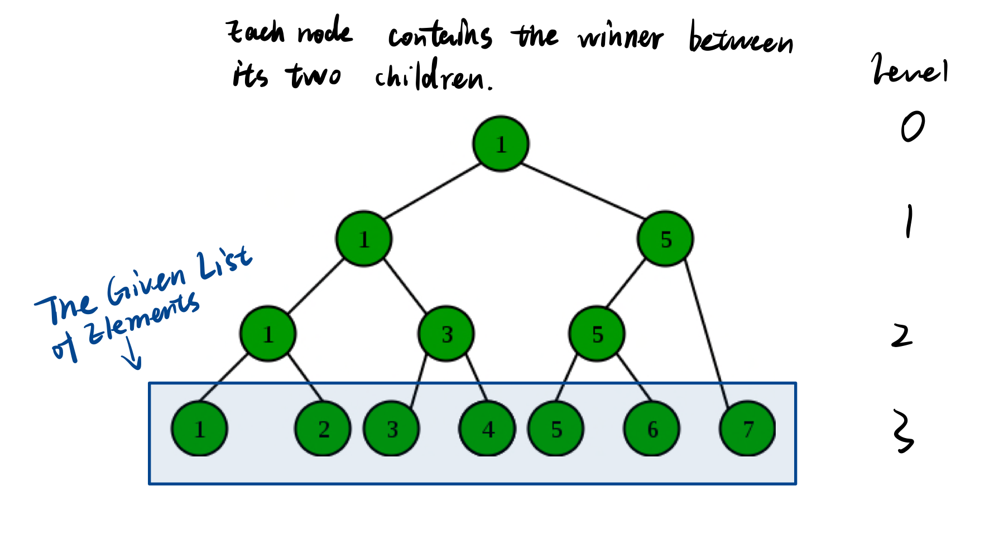

 <!-- Author: Yuxuan Jiang | Group 10 -->
 <!--CS225 Homework 3 Q1   -->
# Exercise 1
### 1.1
The minimum cannot be determined unless all $n$ values have been visited. Then the number of comparisons must be $n-1$ because when traversing the array, the first encountered entry is not compared.
### 1.2
Consider a min-heap

All leaf nodes in the heap represent all entries in the array. Each internal node (nodes with degree 2) has the smaller entry between its two children, which stands for a comparison. Then the number of comparisons, i.e. the number of internal nodes, is given by $L = (n-1)\cdot I + 1$.  
Plug in $L = n$ (n stands for size), $n = 2$, (n stands for the arity of the tree) then $I = n - 1$   
Namely, determining the minimum entry take $n-1$ comparisons.

Now, to determine the second minimum, we need to compare the minimum to all elements that are ever compared to it. Then the number of comparisons is given by the height of the heap, which is $log(n)$

Thus the minimum number of comparisons needed is $n-1 + \log(n)$

### 1.3
> Input  

A doubly linked list of elements with handles stored in an array  

> Output  

The first and second minimum of the elements.  

> Algorithm Description  

The algorithm finds the first minimum with a normal n-1 number of comparisons, then it locates the second minimum by merits of a ***winner tree***. The exact steps are as follows:

1. Starting from the bottom (level 3) (up to this stage the winner tree has not been built), where leaf nodes represents original elements in the list.
2. Execute a comparison between adjacent elements, then form the second bottom level of the winner tree, with nodes represent winners in the comparison.
3. Now move to next level (level 2) and recursively execute comparisons between nodes, again add winners to further complete the tree.
4. As we get to the root of the tree (the only winner is found), the minimum has been found. **Now the algorithm has consumed n-1 comparisons
5. To find the second minimum, the algorithm locates the other child of all nodes containing the minimum just found, and executes comparisons between these children, which takes $log(n)$ comparisons to complete.

